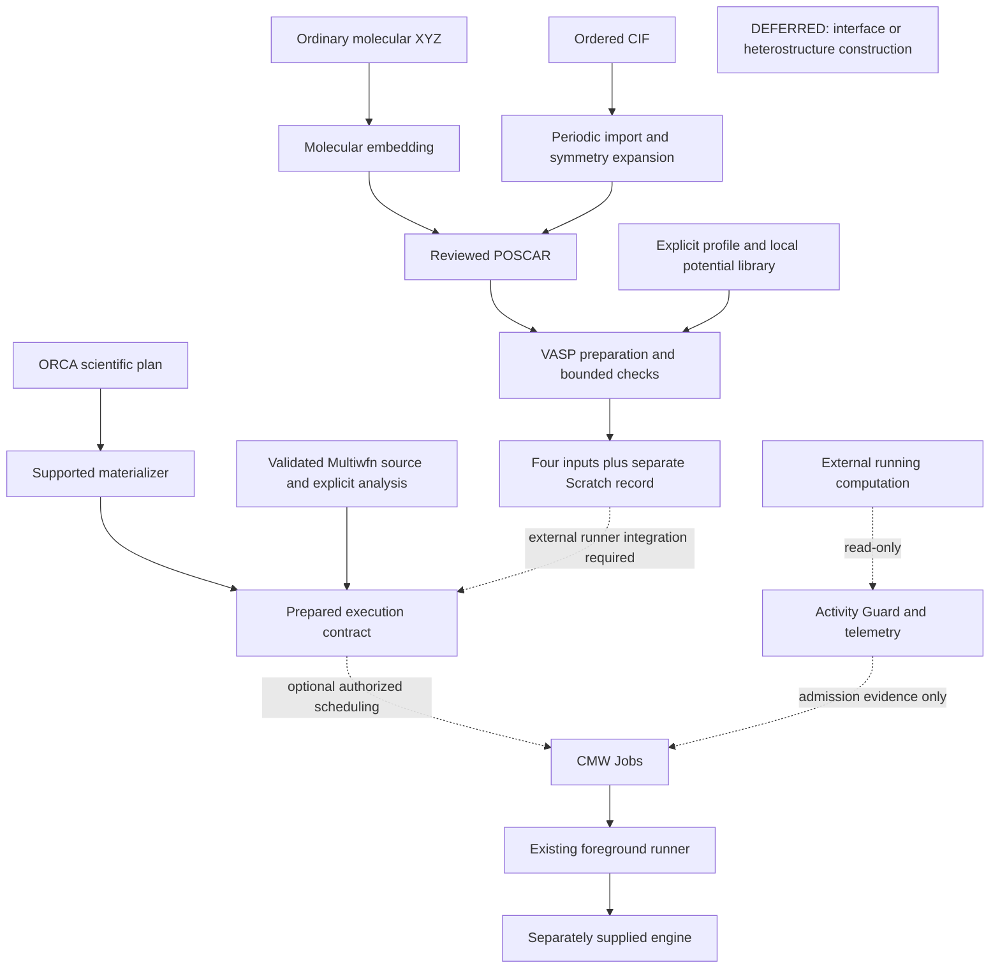

# CMW capability map

**Find an existing route before building another one.** This is a routing index
for the current checkout, not execution authorization or a scientific recipe.
Read only the relevant row and linked contract; verify its entry point before use.

- Structure conversion: [structure routes](#structure).
- VASP inputs: [preparation and checking](#periodic-and-vasp).
- ORCA/Multiwfn/HOF: [molecular workflows](#molecular-workflows).
- Scheduling, observation or Unknown: [Jobs routes](#execution-and-operations).
- Reusable infrastructure: [shared mechanisms](#shared-mechanisms).
- Missing command in another project: [installation check](#using-cmw-from-another-project).

For a **usage request**, use the supported interface. For **development**, extend
that implementation only after identifying a concrete unsupported requirement or
contract mismatch. A small project adapter can compose existing APIs; it should
not replace their validation, materialization, provenance or execution gates.
Source and feature contracts take precedence over this index. Report any drift.

## How to read availability and evidence

**IMPLEMENTED** means the named route exists, within its stated scope.
**PARTIAL** means only the identified part of the task exists.
**EXTERNAL INTEGRATION** requires a separately supplied implementation.
**DEFERRED** is an explicit boundary; **NOT FOUND IN CURRENT CHECKOUT** records
absence from the inspected surfaces, not a claim about all possible software.
Legacy routes are marked separately. None of these labels certifies science.

`cmw …` denotes the installed console entry point. `python -m …` denotes a Python
module entry point, not a top-level `cmw` command. Paths under `scripts/` require
the checkout or extracted sdist; a wheel alone does not supply that script tree.
API rows are importable Python interfaces, not invented console commands.

Tests below are **coverage references**, not evidence they ran in your session.
For distribution/platform boundaries, see [tested support](README.md#tested-support),
[package configuration](pyproject.toml), [installed smoke](tests/installed_smoke.py)
and the [existing CI matrix](.github/workflows/python-package.yml). Workflow
configuration is not proof that a particular commit passed remote CI.

## Task-to-capability routes

### Structure

| Task | Existing entry point / availability | Scope and mechanism to reuse | Contract and evidence |
| --- | --- | --- | --- |
| Put an ordinary molecule in a periodic box | `cmw structure embed-molecule` — IMPLEMENTED | Molecular XYZ; explicit cell-construction intent, charge/cell/vacuum policy. Reuse centering, stable grouping and Scratch mapping. | [Guide](docs/structure/xyz-to-poscar.md), [adapter](src/cmw/structure/embedding.py), [tests](tests/structure/test_embedding.py) |
| Import an ordered periodic CIF | `cmw structure import-cif` — IMPLEMENTED | Ordered core CIF, full occupancy, selected structural block; preserve represented cell and expand symmetry. Reuse importer, periodic model and split publication. | [Guide](docs/structure/cif-import.md), [adapter](src/cmw/structure/cif_import.py), [parser](src/cmw/structure/cif.py), [tests](tests/structure/test_cif.py) |
| Validate molecular XYZ / retain geometry identity | `cmw.structure.xyz.read_xyz`, `geometry_hash`; `structure_artifact_from_file` API — IMPLEMENTED | Strict atom rows, finite Cartesian coordinates and ordered geometry; electronic state belongs to the target. Reuse typed structure validation. | [Contract](docs/architecture/orca-status-and-xyz.md), [XYZ API](src/cmw/structure/xyz.py), [artifact API](src/cmw/core/structure_artifacts.py), [tests](tests/core/test_structure_artifacts.py) |
| Consume imported periodic geometry | `PeriodicStructure`, `PeriodicAtom` API — IMPLEMENTED | Immutable represented cell and ordered fractional/Cartesian atoms; indices link to full source/operator evidence in the import record. | [Model](docs/structure/periodic-model.md), [API](src/cmw/structure/periodic.py), [tests](tests/structure/test_periodic.py) |
| Maintain an existing XYZ conversion integration | `scripts/workflows/xyz_to_poscar.sh`; `cmw.structure.conversion.xyz_to_poscar` — IMPLEMENTED, **legacy publication** | Reuse existing conversion only when its overwrite/adjacent-sidecar contract is intended. New standalone preparation should use `embed-molecule`. | [Guide](docs/structure/xyz-to-poscar.md), [script](scripts/workflows/xyz_to_poscar.sh), [API](src/cmw/structure/conversion.py), [tests](tests/structure/test_conversion.py) |

### Periodic and VASP

| Task | Existing entry point / availability | Scope and mechanism to reuse | Contract and evidence |
| --- | --- | --- | --- |
| Discover local potential variants | `cmw vasp potcar list ELEMENT` — IMPLEMENTED | Caller-supplied library; no dataset download. Reuse discovery before selecting variants. | [Guide](docs/periodic/vasp-potcar.md), [CLI](src/cmw/periodic/vasp/cli.py), [tests](tests/periodic/vasp/test_potcar.py) |
| Build/check POTCAR in POSCAR block order | `cmw vasp potcar build` / `check` — IMPLEMENTED | Preserve repeated species blocks; explicit variants and comparability requirements; distinguish species compatibility from exact selected-byte identity. | [Contract](docs/periodic/vasp-potcar.md), [resolver](src/cmw/periodic/vasp/potentials.py), [tests](tests/periodic/vasp/test_potcar.py) |
| Prepare static inputs from reviewed POSCAR | `cmw vasp prepare --spec …` — IMPLEMENTED | Spec `calculation: static`; explicit scientific profile, mesh and local potentials. Preserve POSCAR bytes; reuse typed resolution and four-file publication. | [Guide](docs/periodic/vasp-preparation.md), [preparer](src/cmw/periodic/vasp/preparation.py), [tests](tests/periodic/vasp/test_preparation.py) |
| Prepare fixed-cell relaxation | Same `cmw vasp prepare` — IMPLEMENTED | Spec `calculation: fixed-cell-relaxation`; bounded ionic controls and explicit required values. No variable-cell or general relaxation claim. | [Guide](docs/periodic/vasp-preparation.md), [preparer](src/cmw/periodic/vasp/preparation.py), [tests](tests/periodic/vasp/test_preparation.py) |
| Check an existing four-file bundle | `cmw vasp check-inputs DIRECTORY` — IMPLEMENTED | Read-only bounded POSCAR/INCAR/KPOINTS/POTCAR checks; optional `--preparation-record`. Invalid and unsupported differ; a pass is not scientific validation. | [Dialect/exit contract](docs/periodic/vasp-input-checking.md), [checker](src/cmw/periodic/vasp/inputs.py), [tests](tests/periodic/vasp/test_inputs.py) |
| Compare a baseline or retain structure lineage | Preparation spec `baseline` / `source_record`; `compare_inputs` API — IMPLEMENTED | Reuse category-aware differences and complete hash-matched import/embedding records. Declared runtime comparison needs record evidence; no observed effective inputs are invented. | [Guide](docs/periodic/vasp-preparation.md#baseline-comparison-and-structure-lineage), [API](src/cmw/periodic/vasp/preparation.py), [handoff tests](tests/structure/test_cif_import.py) |
| Execute prepared VASP inputs | Caller-supplied foreground runner, optionally through Jobs — EXTERNAL INTEGRATION | No native VASP launcher/result finalizer is registered. Review the runner's executable, MPI, resource, restart and output contracts separately. | [Runner integration](docs/cmw-jobs.md#integration-and-foreground-command-contract), [current CLI](src/cmw/cli.py) |

### Molecular workflows

Scientific engines/converters are supplied separately. Preparation and planning
are distinct from commands that execute; consult the linked interface before use.

| Task | Existing entry point / availability | Scope and mechanism to reuse | Contract and evidence |
| --- | --- | --- | --- |
| Run OPT, OPT+SP, OPT+FREQ or OPT+FREQ+SP | `scripts/workflows/run_opt_freq_sp.sh` — IMPLEMENTED, checkout workflow | Explicit XYZ/electronic state/stage settings/resources and local ORCA; `--plan` is non-executing. Reuse stage validation, attempts and fail-closed resume. | [Guide](docs/molecular/orca-opt-freq-sp.md), [script](scripts/workflows/run_opt_freq_sp.sh), [tests](tests/workflows/test_opt_freq_sp.py) |
| Prepare/check/finalize/reuse one ORCA stage | `python -m cmw.molecular.orca.cli` operations `prepare`, `status`, `finalize`, `reuse`; runner `scripts/orca/run_orca.sh` — IMPLEMENTED | Use actual stage policy and typed target/attempt evidence. Parallel production needs the validated runtime contract; shell owns launch and signals. No `cmw orca` alias. | [Lifecycle](docs/architecture/orca-runtime.md), [module CLI](src/cmw/molecular/orca/cli.py), [runner](scripts/orca/run_orca.sh), [tests](tests/runtime/test_orca_shell.py) |
| Convert validated ORCA wavefunction for downstream analysis | `scripts/orca/convert_orca_wavefunction.sh` — IMPLEMENTED, checkout workflow | Requires finalized source and supplied converter. Reuse source hashes, geometry/spin/frontier checks and conversion lineage; no guessed HOMO/LUMO indices. | [Source contract](docs/molecular/multiwfn-cubes.md#validated-source-contract), [script](scripts/orca/convert_orca_wavefunction.sh), [tests](tests/molecular/orca/test_wavefunction_conversion.py) |
| Generate HOMO/LUMO, density/ESP or IGMH cubes | `scripts/workflows/generate_homo_lumo_cubes.sh`, `scripts/workflows/generate_esp_cubes.sh`, `scripts/workflows/generate_igmh_cubes.sh` — IMPLEMENTED | Supplied Multiwfn/runtime settings; validated source, explicit grids/fragments. FMO is a bounded restricted closed-shell subset; IGMH consumes validated density. Reuse sibling workflows and cube checks. | [Guide](docs/molecular/multiwfn-cubes.md), [scripts](scripts/workflows/), [cube tests](tests/workflows/test_multiwfn_cubes.py), [IGMH tests](tests/workflows/test_igmh.py) |
| Prepare/run a two-fragment IFCT revalidation | `scripts/multiwfn/run_ifct.sh SPEC.json NEW_ATTEMPT_DIRECTORY` — IMPLEMENTED, checkout runner | Explicit ORCA TDA state, wavefunction, geometry, atom count and two fragment mappings; supported Multiwfn 2026.7.15 grammar. Reuse renderer and strict finalize checks, not arbitrary menu automation. | [Runner contract](scripts/multiwfn/run_ifct.sh), [spec/finalizer](src/cmw/molecular/multiwfn/ifct_job.py), [sharing guide](docs/cmw-jobs.md#external-vasp-plus-a-prepared-independent-analysis), [tests](tests/molecular/multiwfn/test_ifct_job.py) |
| Render/parse NTO and non-fragment hole/electron analysis | `cmw.molecular.multiwfn.excited_states`; `cmw.molecular.stacking.hole_electron` APIs — IMPLEMENTED | Versioned state/menu contracts and typed artifacts; completeness, exit and output identity are separate. Reuse explicit state mappings; no automatic CT-like state choice. | [Guide](docs/molecular/multiwfn-3.8-excited-state-analysis.md), [renderer/parser](src/cmw/molecular/multiwfn/excited_states.py), [tests](tests/molecular/stacking/test_multiwfn_excited_state_artifacts.py) |
| Plan/assemble intermolecular LED | `python -m cmw.molecular.workflows.intermolecular_led_cli` (`plan`, `finalize`, `reuse`) — IMPLEMENTED | Fixed geometry, two explicit fragments, supported ORCA grammar and ghost-basis references. Reuse ORCA materialization and numerical assembler; not generic association thermodynamics. | [Guide](docs/molecular/orca-intermolecular-led.md), [module](src/cmw/molecular/workflows/intermolecular_led_cli.py), [tests](tests/molecular/workflows/test_intermolecular_led.py) |
| Use HOF configuration and workflow adapters | `load_hof_configuration`, `build_hof_workflow_plan`; `python -m cmw.adapters.hof.execution_cli` — IMPLEMENTED | Explicit two-fragment YAML/configuration and validated parents. Reuse generic graph/materializer; existing HOF queue/full-chain modules retain their own preflight and authorization contracts. | [Guide](docs/adapters/hof.md), [planner](src/cmw/adapters/hof/planner.py), [execution CLI](src/cmw/adapters/hof/execution_cli.py), [full chain](src/cmw/adapters/hof/full_chain.py), [tests](tests/adapters/hof/) |
| Extract a declared molecular registry / assemble a vertical dimer | `extract_stacking_template`, `assemble_vertical_dimer` APIs — IMPLEMENTED | Explicit molecular partitions, ordered cores and validated monomer/template artifacts. Reuse deterministic frames, mappings and relaxation plans; this is not slab/interface assembly. | [Guide](docs/architecture/vertical-stacking-workflow.md), [registry](src/cmw/molecular/stacking/registry.py), [assembly](src/cmw/molecular/stacking/assembly.py), [tests](tests/molecular/stacking/test_stacking_workflow.py) |

### Execution and operations

| Task | Existing entry point / availability | Scope and mechanism to reuse | Contract and evidence |
| --- | --- | --- | --- |
| Schedule prepared foreground commands sequentially | `cmw jobs add`, then separately authorized `start` — IMPLEMENTED | `add` only enqueues. Preserve the runner's preflight, environment, layout and finalization; local ownership scope, no detached/remote workers. | [Guide](docs/cmw-jobs.md#prepared-jobs-and-controls), [CLI](src/cmw/jobs/cli.py), [tests](tests/jobs/test_jobs.py) |
| Run one independent auxiliary beside a primary | `cmw jobs config --mode bounded-sharing`; `sharing` / `add` declarations — IMPLEMENTED | At most one primary and one auxiliary; explicit consent, trusted CPU/RAM bounds, independent non-overlapping writes and fresh admission evidence. Reuse policy; no second scheduler or OS resource enforcement. | [Guide](docs/cmw-jobs.md#bounded-sharing-one-primary-and-one-auxiliary), [policy](src/cmw/jobs/sharing.py), [tests](tests/jobs/test_sharing_policy.py) |
| Permit coexistence with an external computation | `cmw jobs reserve OBSERVATION_ID`, `unreserve` — IMPLEMENTED | Explicit identity-bound CPU/RAM/write-scope reservation in Bounded Sharing. Configuration/reservation does not start jobs, adopt the external process or authorize signals. | [Guide](docs/cmw-jobs.md#external-vasp-plus-a-prepared-independent-analysis), [policy](src/cmw/jobs/sharing.py), [tests](tests/jobs/test_sharing_store.py) |
| Observe external VASP/ORCA/Multiwfn and admission guard | `cmw jobs status`, `watch`, `show E…` — IMPLEMENTED, read-only | Recognized process-family evidence, not filesystem/job adoption. Disappearance means no longer observed, not scientific completion. Reuse identity-aware activity collection. | [Guide](docs/cmw-jobs.md#external-activity-and-admission-guard), [collector](src/cmw/jobs/activity.py), [tests](tests/jobs/test_mpi_family.py) |
| Inspect current CPU/RAM | `cmw jobs status --json`, `show`, `watch` — IMPLEMENTED | Observation quality can be warming/stale/unavailable. Current CPU/RSS are not declared commitments or proof of convergence; `watch` needs the Jobs extra. | [Guide](docs/cmw-jobs.md#current-cpu-and-ram-usage), [telemetry](src/cmw/jobs/telemetry.py), [tests](tests/jobs/test_telemetry.py) |
| Understand a managed Unknown attempt | `cmw jobs show JOB_ID`, `logs JOB_ID` — IMPLEMENTED, read-only | Inspect owner birth/host/boot and existing lock evidence. No force-Done, takeover, blind retry or state deletion; reuse diagnostics before any separately authorized recovery. | [Guide](docs/cmw-jobs.md#persistence-lifecycle-and-recovery), [CLI](src/cmw/jobs/cli.py), [tests](tests/jobs/test_unknown_diagnostics.py) |

**Independent Multiwfn beside external VASP:** select a supported prepared analysis
runner (for IFCT, the runner above), verify its actual thread/memory behavior,
identify the live external observation, and obtain explicit coexistence consent.
Use the same Jobs state, declare the external reservation and auxiliary resources,
independence and disjoint write scope, then request execution authorization.
Low usage, a small expected job or a successful help command grants none of these.

### Shared mechanisms

| Task | Existing entry point / availability | Scope and mechanism to reuse | Contract and evidence |
| --- | --- | --- | --- |
| Express task intent / execution resources | `ExecutionIntent`, `load_execution_profiles` APIs — IMPLEMENTED | Scientific intent and operational profile hashes are separate. ORCA resource translation and Multiwfn thread settings are program-specific; memory declaration is not universal enforcement. | [Profiles](docs/architecture/execution-resource-profiles.md), [intent](src/cmw/core/execution_contract.py), [profiles API](src/cmw/core/execution_profiles.py), [tests](tests/core/test_execution_profiles.py) |
| Materialize dependency-ready workflow nodes | `WorkflowPlanMaterializer`; `python -m cmw.molecular.orca.cli materialize-plan` — IMPLEMENTED | Requires typed artifacts and a supported renderer. Reuse target/attempt numbering, layout, readiness and reuse decisions; no launch and no universal VASP renderer implied. | [Guide](docs/architecture/workflow-plan-materialization.md), [API](src/cmw/core/plan_materialization.py), [tests](tests/core/test_plan_materialization.py) |
| Preserve identities, provenance and artifact lineage | `JobTarget`, `ExecutionAttempt`, `Artifact`; `finalize_artifact_bundle` APIs — IMPLEMENTED | Reuse canonical identities, hashes and explicit program validation evidence. Planned artifacts and operational attempts are not scientific results. | [Graph/artifact contract](docs/architecture/composite-workflow-engine.md), [identity](src/cmw/core/job.py), [provenance](src/cmw/core/provenance.py), [finalizer](src/cmw/core/artifact_finalization.py), [tests](tests/core/test_artifact_finalization.py) |
| Publish prepared inputs apart from provenance | `publication_plan`, `publish_preparation`, `inspect_publication` APIs — IMPLEMENTED | Explicit Scratch and new destinations; no-clobber staging, complete/failed/incomplete states. Reuse split publication instead of copying adjacent metadata. | [Contract](docs/periodic/preparation-publication.md), [API](src/cmw/core/preparation_publication.py), [tests](tests/core/test_preparation_publication.py) |
| Resolve/migrate execution layouts | `ExecutionLayout`; `cmw execution-layout-status`; `cmw migrate-execution-layout` — IMPLEMENTED | Reuse full scientific identity and registry-backed paths. Migration plans first; apply requires exact plan confirmation and external evidence; resume/rollback/audit follow its contract. | [Guide](docs/execution-layout-v2.md), [API](src/cmw/core/execution_layout.py), [tests](tests/core/test_execution_layout_migration.py) |
| Clean provably superseded attempts | `cmw cleanup-attempts --campaign … --superseded-only` — IMPLEMENTED | Default dry run; guarded minimal-provenance apply or irreversible purge with exact `--confirm-plan`. Preserve current/canonical/referenced/active/uncertain attempts; no raw deletion substitute. | [Guide](docs/architecture/attempt-cleanup.md), [API](src/cmw/core/attempt_cleanup.py), [tests](tests/core/test_attempt_cleanup.py) |
| Stage operational execution on external Scratch | ORCA runner external-scratch options; `prepare_external_scratch`, `copy_back_external_scratch`, `cleanup_external_scratch` APIs — IMPLEMENTED | Mounted volume, capacity/filesystem checks, owned session, allowlisted verified copyback and guarded cleanup. Distinct from preparation-record Scratch; no fallback when unavailable. | [Runner lifecycle](docs/architecture/orca-runtime.md), [transaction contract](src/cmw/core/external_scratch.py), [tests](tests/core/test_external_scratch.py) |
| Inspect process health / disk admission | `cmw.core.process_health`; `check_storage_capacity` APIs — IMPLEMENTED | Advisory process evidence and storage floors; reuse runner gates without converting health into scientific success or an automatic termination policy. | [Health guide](docs/architecture/process-health.md), [storage API](src/cmw/core/storage.py), [tests](tests/core/test_storage.py) |

### Analysis and reporting

| Task | Existing entry point / availability | Scope and mechanism to reuse | Contract and evidence |
| --- | --- | --- | --- |
| Prepare DOS/projection/band-path arrays | `cmw.analysis.electronic` APIs — IMPLEMENTED | Caller-supplied arrays, labels and conventions. Reuse energy shifting, explicit projection grouping and disconnected reciprocal segments; readers, spin interpretation and plotting remain caller-owned. | [Guide](docs/electronic-arrays.md), [API](src/cmw/analysis/electronic.py), [tests](tests/test_electronic_arrays.py) |
| Normalize/join excited-state results | `normalize_tda_manifold`, `join_excited_state_tables` APIs — IMPLEMENTED | Explicit state identity and finalized NTO/HEA artifacts; reuse provenance-aware joins instead of matching labels/row positions by guess. | [State contract](docs/molecular/orca-6.1-tda-excited-states.md), [table API](src/cmw/molecular/excited_state_tables.py), [tests](tests/molecular/test_excited_state_tables.py) |
| End-to-end periodic result reporting | Array preparation above — PARTIAL | No universal VASP result reader, scientific finalizer or report generator is established by those array helpers. | [Array boundary](docs/electronic-arrays.md), [periodic package](src/cmw/periodic/vasp/) |

## Workflow boundaries at a glance



Solid arrows show preparation/data flow or the explicitly labelled execution
branch. Dotted arrows show optional orchestration, external integration or
read-only evidence. Preparation never starts that execution branch automatically.
ORCA and Multiwfn retain their distinct program-specific finalizers; the shared
artifact finalizer does not supply missing VASP scientific validation.

## High-risk routing distinctions

### Molecular embedding versus periodic import

Ordinary molecular XYZ goes to embedding **only when constructing a periodic
model is intended**. Embedding can create a cell, center the molecule and add
vacuum. It is not lossless generic periodic conversion. Canonical embedding
rejects periodic extended XYZ and CIF; dependency-level parser support is not a
CMW contract. See the [embedding limits](docs/structure/xyz-to-poscar.md).

Ordered CIF goes to the dedicated importer, not embedding or an ad hoc ASE
read/write script. The [current CIF contract](docs/structure/cif-import.md) is:

- One structural candidate is selected automatically; multiple candidates require
  `--block`. Metadata-only blocks are retained as selection evidence.
- Preserve represented a/b/c basis and metric. CIF metrics define no absolute
  Cartesian orientation; CMW uses a along +x, b in xy and c with positive z.
  No primitive/conventional conversion, reduction, supercell, centering or vacuum.
- Require full occupancy (absent occupancy column uses the recorded dictionary
  default); reject unknown/partial occupancy, unresolved disorder, overlapping
  source orbits, magnetic/special unsupported models and implicit missing H.
- Expand a complete explicit symmetry group or an unambiguous declared setting.
  Special-position images collapse within a source orbit, retaining all generating
  operations; ambiguous near-special positions are rejected, not snapped.
- Write Direct coordinates in `[0,1)`, rounded to 12 decimals. Record the periodic
  fractional tolerances and Cartesian equivalence checks; retain original values.
- Preserve source-site → expanded-atom → POSCAR mappings. Species use stable
  first-occurrence grouping, with deterministic ordering inside each block.

[Core tests](tests/structure/test_cif.py) and [publication/handoff tests](tests/structure/test_cif_import.py)
cover these boundaries; parser availability alone is insufficient evidence.
The immutable model and record can feed future modeling without reparsing CIF.

### Prepared POSCAR and scientific evidence

An already reviewed POSCAR goes directly to checking/preparation. Do not re-embed,
sort, wrap, center or regenerate it. The preparer retains exact source bytes,
including repeated species blocks and supported constraints. Optional import or
embedding lineage requires a complete record and an exact byte match.

A potential's element/variant/family, exact selected bytes and caller-declared
library release are different evidence. Dataset dates do not establish a release.
POTCAR data must be supplied locally; CMW neither bundles nor automatically
fetches it, and real payloads must not enter public Git artifacts.

Preparation is not execution. A bounded input-check pass does not establish
universal dialect support, DFT suitability, SCF convergence or ionic convergence.
Requested scientific settings, committed inputs, declared runtime overlays and
observed effective inputs are separate. VASP preparation records the last as
unobserved. Jobs Done establishes its operational completion contract, not
scientific convergence; ORCA validation also requires stage-specific evidence.

## Output and materialization contracts

For canonical VASP preparation:

```text
research calculation input directory/     explicit Scratch record directory/
    INCAR                                     preparation.json
    KPOINTS
    POSCAR
    POTCAR
```

For canonical standalone embedding or CIF import:

```text
requested structure destination: POSCAR only
explicit Scratch record directory: preparation.json with metadata/mappings
```

Neither canonical route suggests adjacent metadata/mapping files, copied specs,
README, run.sh or metadata symlinks. Dry run writes nothing; existing destinations
and unavailable Scratch are refused. A failure after input publication can leave
an **incomplete** record and retained inputs; inspect it rather than claiming
success. See [split publication](docs/periodic/preparation-publication.md).

The four-file rule does **not** apply to all CMW workflows. Molecular execution
layouts, cube outputs, logs and typed artifacts follow their own contracts.
The legacy XYZ converter still has adjacent mapping/metadata and overwrite
behavior; do not transfer that convention to canonical structure preparation.

## Known gaps and deferred capabilities

| Task | Availability / boundary |
| --- | --- |
| Two CIFs into an interface or heterostructure | DEFERRED. Model construction, not concatenation or conversion. A separate scoped task must resolve slab/bulk status, Miller planes, termination/thickness, integer matching, twist, mismatch/strain, registry, separation, overlaps, vacuum/periodicity and A/B origin mapping. [Scientific handoff](docs/structure/cif-import.md#future-interface-construction-handoff). |
| Disordered, magnetic, superspace or unsupported special CIF import | NOT FOUND IN CURRENT CHECKOUT as a supported canonical route. Ordered import rejects these; do not resolve the scientific model by selecting occupancies or bypassing the importer. |
| Native VASP launch and scientific-result validation | NOT FOUND IN CURRENT CHECKOUT. External foreground-runner integration and bounded input checking do not provide either capability. |
| Cluster scheduling, cluster locks, arbitrary backfill or generic retry ladders | Outside implemented local contracts. Use the [Jobs limits](docs/cmw-jobs.md) and [ORCA lifecycle](docs/architecture/orca-runtime.md); a separate implementation/authorization decision is needed. |
| Automatic CT-like state choice or general fragment-resolved HEA | DEFERRED beyond the explicit supported analysis contracts. The dedicated two-fragment IFCT runner does not make the older non-fragment HEA renderer universal. [Analysis boundary](docs/molecular/multiwfn-3.8-excited-state-analysis.md#unsupported-and-deferred-analysis). |

## Using CMW from another project

CMW's root AGENTS.md/map are not automatically loaded in a research repository or
Scratch directory. The active project's guidance must explicitly point here.
That reference imports routing information, not CMW's entire instruction policy.
Existing sessions may need an explicit read or a new session; no hot reload or
guaranteed agent compliance is implied.

If a command is missing, first identify the selected installation and interpreter:

```sh
command -v cmw
cmw --help
cmw structure import-cif --help
# CMW_PYTHON is the interpreter belonging to that selected installation.
"$CMW_PYTHON" -c 'import sys, cmw; from importlib.metadata import version; print(sys.executable); print(cmw.__file__); print(version("computational-modelling-workflow"))'
```

Compare with [current registration](src/cmw/cli.py), the linked module/script and
[package entry point](pyproject.toml). `CMW_CHECKOUT` below denotes the declared
checkout path, not a literal directory name. Where that checkout's dependencies
are already available, a safe source-surface check is:

```sh
PYTHONDONTWRITEBYTECODE=1 PYTHONPATH="$CMW_CHECKOUT/src" \
  "$CMW_PYTHON" -m cmw.cli structure import-cif --help
```

A failed first help command, guessed flag, stale installation or wrong environment
does not establish a missing capability. CLI absence does not establish API or
workflow absence. Report the concrete mismatch and choose an authorized existing
entry point/environment correction; do not install, duplicate or bypass silently.

Copyable consumer-project guidance (`CMW_CHECKOUT` is a placeholder to resolve):

> Locate the declared `CMW_CHECKOUT` and read its root `CAPABILITY_MAP.md` plus the
> relevant feature contract. Verify that the selected installation exposes the
> required CLI/API, or use the documented checkout workflow. Prefer that capability
> over a duplicate local implementation. Keep this project's instructions,
> scientific choices and execution-approval requirements in force. Report missing
> or unsupported requirements; do not silently bypass CMW checks. This reference
> supplies routing guidance, not the whole CMW repository policy.

## Maintenance

A commit that adds, renames, removes, promotes or materially changes a user-facing
capability must update its map entry, route, scope and canonical links in the same
coherent change. Internal refactors with unchanged contracts need no map churn.
Keep one root map; feature guides remain authoritative. Do not add changing test
counts or use package version alone as a maturity guarantee.
